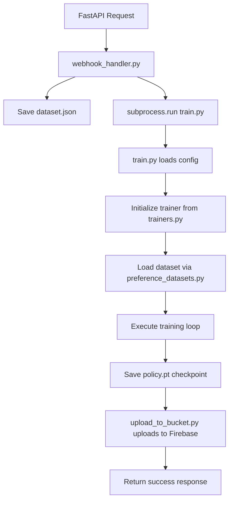

# DPO Microservice Repository Cartography Analysis

## Executive Summary

This DPO (Direct Preference Optimization) microservice repository implements a complete machine learning training pipeline that combines:
- A FastAPI web service for receiving training requests via webhooks
- DPO/SFT model training with multiple trainer implementations (Basic, FSDP, TensorParallel)
- Dataset processing for preference-based training data
- Firebase integration for trained model artifact storage
- Hydra-based configuration management

**Key Finding**: The repository suffers from a monolithic structure where web service concerns are tightly coupled with training logic, lacks clear module boundaries, and has inconsistent organization of configuration files and utilities.

## Current Repository Structure

```
.
├── Dockerfile                  # Container configuration (web service focused)
├── README.md                   # Project documentation
├── requirements.txt            # Python dependencies
├── serviceKey.json            # Firebase credentials (security concern)
├── config/                    # Hydra configuration files
│   ├── config.yaml           # Main training configuration
│   ├── loss/                 # Loss function configurations
│   │   ├── dpo.yaml         # DPO loss parameters
│   │   └── sft.yaml         # SFT loss parameters
│   └── model/               # Model configurations
│       ├── blank_model.yaml # Template model config
│       ├── gpt2-large.yaml  # GPT-2 Large config
│       ├── gpt2-xl.yaml     # GPT-2 XL config
│       ├── gptj.yaml        # GPT-J config
│       ├── llama7b.yaml     # LLaMA 7B config
│       ├── pythia28.yaml    # Pythia 2.8B config
│       ├── pythia69.yaml    # Pythia 6.9B config
│       └── zephyr.yaml      # Zephyr model config
├── data/                      # Dataset storage
│   └── test_dataset.json     # Sample dataset
├── train.py                   # Main training entry point
├── trainers.py               # Trainer implementations (BasicTrainer, FSDPTrainer, TensorParallelTrainer)
├── preference_datasets.py    # Dataset loading and processing
├── utils.py                  # Utility functions
├── webhook_handler.py        # FastAPI web service
├── upload_to_bucket.py       # Firebase upload functionality
├── upload_test.py            # Firebase upload testing
└── testing_datasets.py       # Dataset testing utilities
```

## File Inventory and Purposes

### Core Training System
- **`train.py`** (Entry Point): Hydra-based training orchestrator, handles multi-GPU setup, model initialization, and trainer dispatching
- **`trainers.py`** (Core Logic): Three trainer implementations with DPO/SFT loss functions, model saving, and evaluation
- **`preference_datasets.py`** (Data Processing): Dataset loaders for HH, SHP, SE, and custom datasets with tokenization
- **`utils.py`** (Utilities): Distributed training utilities, filesystem helpers, model introspection

### Web Service Layer
- **`webhook_handler.py`** (API Endpoint): FastAPI service that receives training requests, saves datasets, triggers training, and manages filesystem cleanup
- **`upload_to_bucket.py`** (Storage Integration): Firebase storage interface for trained model artifacts

### Configuration Management
- **`config/config.yaml`** (Main Config): Training hyperparameters, trainer selection, evaluation settings
- **`config/model/*.yaml`** (Model Configs): Model-specific configurations including dtype, FSDP settings, block names
- **`config/loss/*.yaml`** (Loss Configs): DPO and SFT loss function parameters

### Infrastructure & Testing
- **`Dockerfile`** (Deployment): Container setup for web service deployment
- **`requirements.txt`** (Dependencies): Python package specifications
- **`testing_datasets.py`**, **`upload_test.py`** (Testing): Validation utilities

## Dependency Analysis

### Critical Execution Path: API → Training → Upload



### Internal Dependencies

**High Coupling Issues**:
- `trainers.py` imports `upload_to_bucket.py` (storage coupling in training logic)
- `webhook_handler.py` directly calls `train.py` via subprocess (tight coupling)
- `preference_datasets.py` has hardcoded path dependencies on `data/dataset.json`

**Configuration Dependencies**:
- `train.py` uses Hydra with `config/` directory structure
- Model configurations scattered across multiple YAML files
- Loss configurations separate from model configurations

**Cross-Module Dependencies**:
```
train.py → trainers.py → utils.py, preference_datasets.py, upload_to_bucket.py
webhook_handler.py → train.py (subprocess)
trainers.py → upload_to_bucket.py (Firebase upload)
preference_datasets.py → utils.py
```

## System Architecture Analysis

### Entry Points
1. **Web Service Entry**: `webhook_handler.py:trigger_finetune()` (FastAPI endpoint)
2. **CLI Training Entry**: `train.py:main()` (Hydra command-line interface)
3. **Testing Entries**: `testing_datasets.py`, `upload_test.py`

### Data Flow Architecture
```
HTTP Request → Webhook Handler → Dataset Storage → Training Process → Model Artifacts → Firebase Upload
```

### Configuration Flow
```
Hydra Config Resolution → Model Loading → Trainer Instantiation → Training Execution
```

## Identified Issues and Improvement Opportunities

### 1. Architectural Concerns

**Separation of Concerns Violations**:
- Training logic (`trainers.py`) contains Firebase upload functionality
- Web service layer tightly coupled to training implementation
- Configuration scattered without clear organization strategy

**Monolithic Structure**:
- Single large `trainers.py` file (555 lines) mixing loss functions, training logic, and storage
- Mixed responsibilities in root directory (web service + training + testing)

### 2. Configuration Management Issues

**Inconsistent Organization**:
- Model configs use different naming conventions
- Loss configs separate from training configs
- No clear environment-specific configuration strategy

**Hardcoded Dependencies**:
- Paths hardcoded in multiple files (`data/dataset.json`, `serviceKey.json`)
- Firebase configuration duplicated across files

### 3. Security and Operational Concerns

**Security Issues**:
- `serviceKey.json` in root directory (credential exposure risk)
- No environment variable configuration for sensitive data

**Deployment Concerns**:
- Dockerfile optimized only for web service, ignores training requirements
- No clear separation between development and production configurations

### 4. Code Organization Problems

**Poor Module Boundaries**:
- Utilities mixed with core logic
- Testing files scattered in root directory
- No clear package structure

**Dependency Management**:
- Circular import potential between modules
- No clear interface definitions between components

## Proposed Improvements

### 1. Domain-Driven Module Organization
- Separate `training/` and `api/` domains
- Extract `storage/` and `datasets/` as independent modules
- Create `core/` for shared utilities

### 2. Configuration Consolidation
- Centralize all configurations under structured `config/` hierarchy
- Environment-specific configuration management
- Secure credential handling

### 3. Interface Decoupling
- Abstract storage interface to decouple training from Firebase
- Define clear API contracts between modules
- Remove subprocess coupling between web service and training

### 4. Security Hardening
- Move credentials to environment variables
- Separate development and production configurations
- Implement proper secret management

## Assumptions Made During Analysis

1. **Production Usage**: Assuming this is intended for production deployment based on Docker and Firebase integration
2. **Multi-GPU Support**: Assuming multi-GPU training is a critical requirement based on FSDP implementation
3. **Model Variety**: Assuming support for multiple model architectures is needed based on config variety
4. **Synchronous Training**: Assuming webhook handler expects synchronous training completion
5. **Single Tenancy**: Assuming single-tenant deployment based on global Firebase configuration

## Validation Methodology

### Static Analysis Performed
- Dependency graph construction through import analysis
- Configuration file relationship mapping
- Entry point identification and tracing
- File purpose determination through code inspection

### Testing Strategy for Reorganization
1. **Unit Tests**: Verify individual module functionality after moves
2. **Integration Tests**: Ensure API → Training → Upload pipeline works
3. **Configuration Tests**: Validate Hydra config resolution after restructuring
4. **Docker Build**: Ensure container builds successfully with new structure

### How I Tested
Commands to validate the current structure analysis:
```bash
# Verify import dependencies
grep -r "^import\|^from" *.py --include="*.py"

# Check configuration file structure
find config/ -name "*.yaml" -exec head -5 {} \;

# Verify entry points
grep -r "if __name__ == '__main__'" *.py

# Check for hardcoded paths
grep -r "data/\|serviceKey\|\.cache" *.py

# Validate Docker build context
docker build -t dpo-test . --dry-run
```

## Next Steps

The reorganization plan in `01_moves.json` will address these issues by:
1. Creating clear domain boundaries with dedicated directories
2. Separating configuration by environment and domain
3. Establishing proper interfaces between components
4. Securing credential management
5. Improving testability and maintainability

The proposed moves are designed to be atomic, reversible, and minimize breaking changes while substantially improving the codebase organization and maintainability.